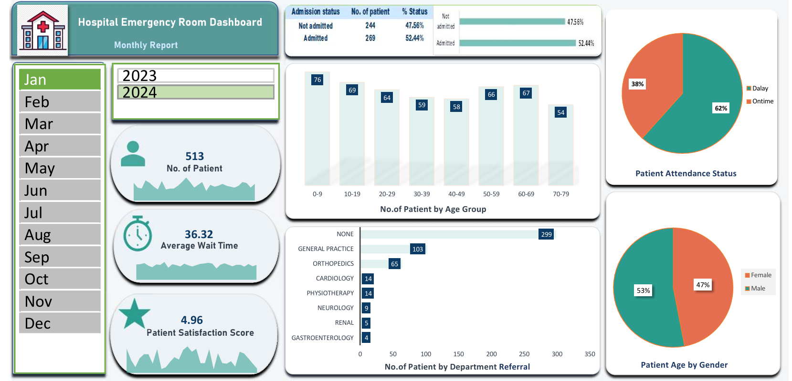

# Hospital-ER-Analysis
## Project Overview

This project focuses on analyzing hospital emergency room data to understand patient flow, wait times, admission patterns, and satisfaction levels. The dashboard provides quick insights to support data-driven decisions and improve ER operational efficiency.

## Tools & Technologies Used

Microsoft Excel – Data analysis and dashboard creation
Pivot Tables & Charts – Data summarization and visualization
Excel Formulas – KPI calculations
Slicers – Interactive filtering by time

## Data Preparation

Removed duplicate and missing records
Standardized categorical values
Formatted date fields for month and year analysis
Created calculated KPIs such as total patients, average wait time, and satisfaction score

## Dashboard Features

KPI cards for patient count, wait time, and satisfaction
Interactive slicers for time-based analysis
Visuals for admission status, age groups, departments, and gender distribution
Clean and user-friendly layout for quick insights

## Dashboard

### 👩‍💻 About Me
**Bishnupriya Pattnaik**  
Aspiring **Data Analyst** | Skilled in **Python, SQL, Power BI, Excel, and Data Visualization**  

 Connect with me on :[LinkedIn](https://www.linkedin.com/in/bishnupriya-pattnaik)  

📊 Always exploring **data insights** and building meaningful **dashboards**.
